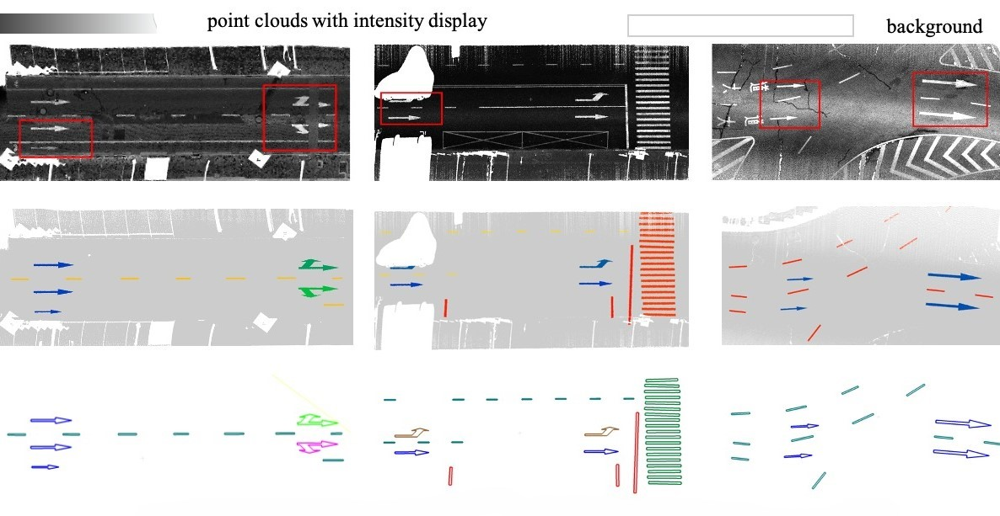








# 🙈 About me

I am a PhD student in [LIESMARS](https://liesmars.whu.edu.cn/), [Wuhan University](https://www.whu.edu.cn/). My advisors are Prof. [Zhen Dong](https://dongzhenwhu.github.io/index.html) and Prof. [Bisheng Yang](https://3s.whu.edu.cn/info/1025/1415.htm). Previously, I obtained my B.Eng degree at [School of Remote Sensing and Information Engineering](https://rsgis.whu.edu.cn/), Wuhan University.

My research interest lies in the field of Point Cloud Processing and Intelligent Transportation. If you are interested in my research, feel free to contact me at <liuchongwhu@whu.edu.cn>!

I am a member of [WHU-USI3DV](https://github.com/WHU-USI3DV), please check advancements on point cloud processing including enhancement, registration, localization, segmentation, detection, etc.

# 📝 Publications
**\* denotes equal contributions and † denotes the corresponding author.**

Remote Sensing 2024

Three-Dimensional Reconstruction of Zebra Crossings in Vehicle-Mounted LiDAR Point Clouds

Zhenfeng Zhao, Shu Gan, Bo Xiao, Xinpeng Wang, **Chong Liu&dagger;**

**Remote Sensing 2024 (IF: 4.2)**

[[Paper]](https://www.mdpi.com/2072-4292/16/19/3722)

ISPRS 2024

WHU-Urban3D: An urban scene LiDAR point cloud dataset for semantic instance segmentation

Xu Han*, **Chong Liu***, Yuzhou Zhou, Kai Tan, Zhen Dong&dagger;, Bisheng Yang&dagger;

**ISPRS J 2024 (IF: 10.6)**

[[Paper]](https://www.sciencedirect.com/science/article/pii/S0924271624000522), [[DataSet]](https://whu3d.com/)

ISPRS 2021

A two-stage approach for road marking extraction and modeling using MLS point clouds

Xiaoxin Mi, Bisheng Yang&dagger;, Zhen Dong&dagger;, **Chong Liu**, Zeliang Zong, Zhenchao Yuan

**ISPRS J 2021 (IF: 11.7)**

[[Paper]](https://www.sciencedirect.com/science/article/pii/S0924271621001970?via%3Dihub)

# 💡 National Invention Patent
- **刘翀**,董震,米晓新.一种基于车载激光点云的斑马线三维重建方法及系统:CN202210729496.0[P].CN202210729496.0. **已授权**
- 杨必胜,**刘翀**,米晓新,等.联合点云强度和几何结构的道路标志提取方法及系统:CN202111274991.9[P].CN202111274991.9. **已授权**

# 👻 Honors and Awards
- *2023.10*, **地理信息科技进步奖二等奖** "基于激光点云的城市道路空间信息智能提取关键技术与应用" （个人排名 7）
- *2023.09*, **测绘科学技术奖二等奖** "地理实体数据高效生产与服务关键技术及应用" （个人排名 8）
- *2022.09*, **测绘科学技术奖二等奖** "面向智能交通时空信息服务的三维激光点云数据自动处理关键技术研究" （个人排名 8）
