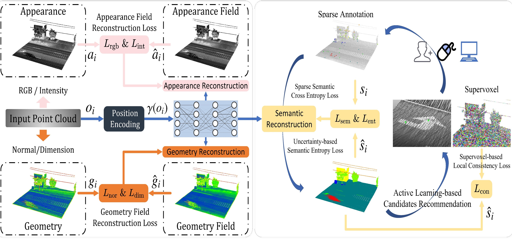
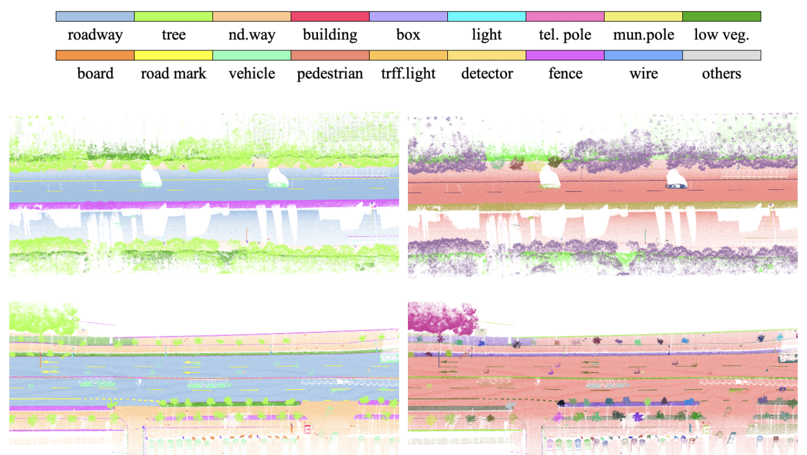
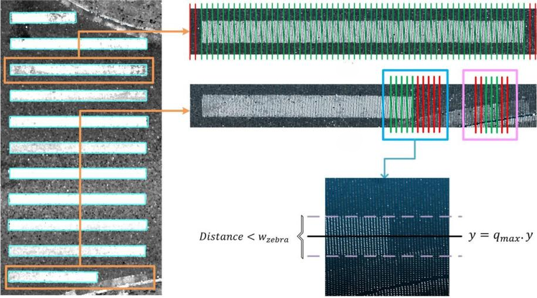
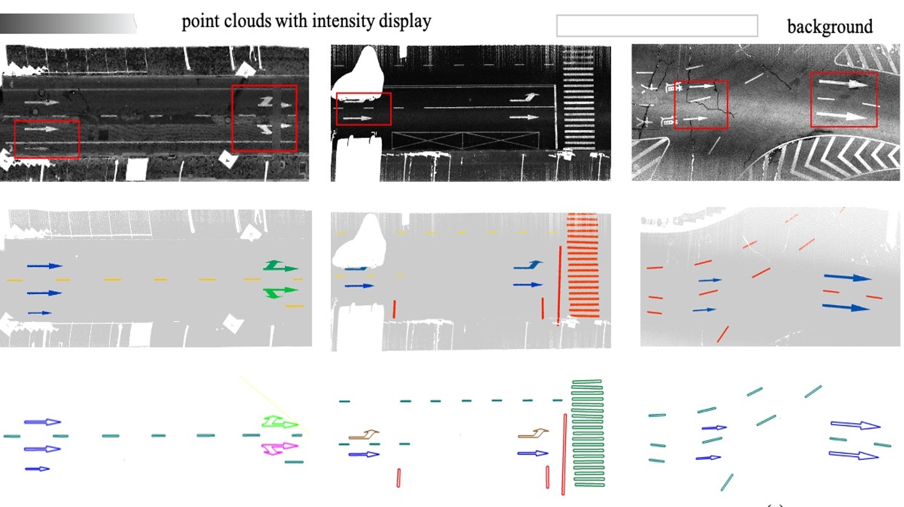








# 🙈 About me

I am a PhD student in [LIESMARS](https://liesmars.whu.edu.cn/), [Wuhan University](https://www.whu.edu.cn/). My advisors are Prof. [Zhen Dong](https://dongzhenwhu.github.io/index.html) and Prof. [Bisheng Yang](https://3s.whu.edu.cn/info/1025/1415.htm). Previously, I obtained my B.Eng degree at [School of Remote Sensing and Information Engineering](https://rsgis.whu.edu.cn/), Wuhan University.

My research interests lie in the road scene reconstruction and understanding using images and point clouds. If you are interested in my research, feel free to contact me at <liuchongwhu@whu.edu.cn>!

I am a member of [WHU-USI3DV](https://github.com/WHU-USI3DV), please check advancements on point cloud processing including enhancement, registration, localization, segmentation, detection, etc.

# 📝 Publications
**\* denotes equal contributions and † denotes the corresponding author.**

Arxiv 2026

SVII-3D: Advancing Roadside Infrastructure Inventory with Decimeter-level 3D Localization and Comprehension from Sparse Street Imagery

**Chong Liu**, Luxuan Fu, Yang Jia, Zhen Dong&dagger;, Bisheng Yang

**Arxiv 2026**

[[Paper]](https://arxiv.org/abs/2601.10535)

Arxiv 2026

Unleashing the Capabilities of Large Vision-Language Models for Intelligent Perception of Roadside Infrastructure

Luxuan Fu*, **Chong Liu***, Bisheng Yang&dagger;, Zhen Dong

**Arxiv 2026**

[[Paper]](http://arxiv.org/abs/2601.10551)

AIC 2025

Training-free open-set 3D inventory of transportation infrastructure by combining point clouds and images

**Chong Liu**, Mingyu Xie, Changzheng Yuan, Fuxun Liang&dagger;, Zhen Dong, Bisheng Yang

**Automation in Construction 2025 (IF: 11.5)**

[[Paper]](https://www.sciencedirect.com/science/article/pii/S0926580525004170)

TITS 2024

INF-PCA: Implicit Neural Field-Based Interactive Point Cloud Semantic Annotation

**Chong Liu***, Xu Han*,  Weihong Huang, Chen Long, Wang Wang, Zhen Dong&dagger;, Bisheng Yang&dagger;

**IEEE TRANSACTIONS ON INTELLIGENT TRANSPORTATION SYSTEMS 2024 (IF: 8.4)**

[[Paper]](https://ieeexplore.ieee.org/document/10767851)

ISPRS 2024

WHU-Urban3D: An urban scene LiDAR point cloud dataset for semantic instance segmentation

Xu Han*, **Chong Liu***, Yuzhou Zhou, Kai Tan, Zhen Dong&dagger;, Bisheng Yang&dagger;

**ISPRS JOURNAL OF PHOTOGRAMMETRY AND REMOTE SENSING 2024 (IF: 12.2)**
 
🆠ESI Highly Cited Paper !

[[Paper]](https://www.sciencedirect.com/science/article/pii/S0924271624000522), [[DataSet]](https://whu3d.com/)

RS 2024

Three-Dimensional Reconstruction of Zebra Crossings in Vehicle-Mounted LiDAR Point Clouds

Zhenfeng Zhao, Shu Gan, Bo Xiao, Xinpeng Wang, **Chong Liu&dagger;**

**Remote Sensing 2024 (IF: 4.1)**

[[Paper]](https://www.mdpi.com/2072-4292/16/19/3722)

ISPRS 2021

A two-stage approach for road marking extraction and modeling using MLS point clouds

Xiaoxin Mi, Bisheng Yang&dagger;, Zhen Dong&dagger;, **Chong Liu**, Zeliang Zong, Zhenchao Yuan

**ISPRS JOURNAL OF PHOTOGRAMMETRY AND REMOTE SENSING 2021 (IF: 11.7)**

[[Paper]](https://www.sciencedirect.com/science/article/pii/S0924271621001970?via%3Dihub)

AIC 2025

Unified data synthesis for automated 3D Visual Inspection and digital twinning of bridges

Wang Wang, Mingjing Xu, Zhen Cao, Jingzi Guo, **Chong Liu**, Haowei Zhang, Xiaoling Zhang

**Automation in Construction 2025 (IF: 11.5)**

[[Paper]](https://www.sciencedirect.com/science/article/pii/S0926580525007812)

# 💡 National Invention Patent
- **刘翀**,董震,米晓新.一种基于车载激光点云的斑马线三维重建方法及系统:CN202210729496.0[P]. **已授权**
- 杨必胜,**刘翀**,米晓新,等.联合点云强度和几何结构的道路标志提取方法及系统:CN202111274991.9[P]. **已授权**
- **刘翀**,朱贵方,李强,等.基于隐式神经场网络的点云交互式语义标注方法和装置:CN202411062689.0[P]. **已授权**
- 董震,**刘翀**,梁福逊.开放集交通基础设施三维数字化大模型构建方法与装置:CN202510601387.4[P]. **已授权**

# 👻 Honors and Awards
- *2023.10*, **地理信息科技进步奖二等奖** "基于激光点云的城市道路空间信息智能提取关键技术与应用" （个人排名 7）
- *2023.09*, **测绘科学技术奖二等奖** "地理实体数据高效生产与服务关键技术及应用" （个人排名 8）
- *2022.09*, **测绘科学技术奖二等奖** "面向智能交通时空信息服务的三维激光点云数据自动处理关键技术研究" （个人排名 8）
